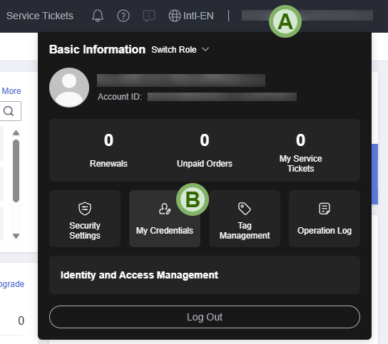

# 👣 First Steps with Terraform and Huawei Cloud

🔙 Back to [README](../README.md).

🌐 **Language**: **English** | [Português](./FIRST_STEPS.pt.md)

- [👣 First Steps with Terraform and Huawei Cloud](#-first-steps-with-terraform-and-huawei-cloud)
  - [💿 Terraform installation](#-terraform-installation)
    - [Windows](#windows)
    - [Ubuntu/Debian](#ubuntudebian)
  - [🔑 Creating an access key (AK and SK)](#-creating-an-access-key-ak-and-sk)
  - [👩‍💻 Main Terraform commands](#-main-terraform-commands)
  - [😣 Troubleshooting](#-troubleshooting)

## 💿 Terraform installation

Install Terraform: <https://developer.hashicorp.com/terraform/install>

### Windows

Open PowerShell and run `winget install HashiCorp.Terraform` command.

```plain
PS C:\> winget install HashiCorp.Terraform
Found HashiCorp Terraform [Hashicorp.Terraform] Version 1.13.5
This application is licensed to you by its owner.
Microsoft is not responsible for, nor does it grant any licenses to, third-party packages.
Downloading https://releases.hashicorp.com/terraform/1.13.5/terraform_1.13.5_windows_amd64.zip
  ██████████████████████████████  28.9 MB / 28.9 MB
Successfully verified installer hash
Extracting archive...
Successfully extracted archive
Starting package install...
Path environment variable modified; restart your shell to use the new value.
Command line alias added: "terraform"
Successfully installed
PS C:\>
```

Close PowerShell, open it again, and `terraform` command should be available.
Run command `terraform version` to confirm that Terraform is installed. You
should see something like this:

```plain
PS C:\> terraform version
Terraform v1.13.5
on windows_amd64
PS C:\>
```

### Ubuntu/Debian

Run the following commands:

```sh
sudo apt update && sudo apt install -y gnupg software-properties-common

wget -O - https://apt.releases.hashicorp.com/gpg | \
  sudo gpg --dearmor -o /usr/share/keyrings/hashicorp-archive-keyring.gpg

echo "deb [arch=$(dpkg --print-architecture) signed-by=/usr/share/keyrings/hashicorp-archive-keyring.gpg] https://apt.releases.hashicorp.com $(grep -oP '(?<=UBUNTU_CODENAME=).*' /etc/os-release || lsb_release -cs) main" | sudo tee /etc/apt/sources.list.d/hashicorp.list

sudo apt update && sudo apt install -y terraform
```

Run command `terraform version` to confirm that Terraform is installed. You
should see something like this:

```plain
$ terraform version
Terraform v1.13.5
on linux_amd64
```

## 🔑 Creating an access key (AK and SK)

An access key comprises an **access key ID (AK)** and **secret access key (SK)**,
and is used as a long-term identity credential to sign your requests for Huawei
Cloud APIs (made by Terraform provider). AK is used together with SK to sign
requests cryptographically, ensuring that the requests are secret, complete,
and correct. For more details, see
[Access Keys documentation](https://support.huaweicloud.com/intl/en-us/usermanual-ca/ca_01_0003.html)

To create an access key for your Huawei Cloud account, first log in to
[Huawei Cloud Console](https://console-intl.huaweicloud.com/).

1. Put your mouse over your username in the top right corner (A) and click on
   "My Credentials" (B) in the dropdown menu;

    

2. On the left side menu, click on "Access Keys" and then click on "Create
   Access Key";

    

3. Enter a description (optional) and then click on "OK";

    

4. Click on "Download" (G) in the modal message. A file named `credentials.csv`
   will be saved;

   

5. Open the `credentials.csv` file in Notepad. It should have the following
   layout:

    ```plain
    User Name,Access Key Id,Secret Access Key
    "username",**********,##########
    ```

6. On the second line, the second part is the Access Key (AK), and the third
   part is the Secret Key (SK).

## 👩‍💻 Main Terraform commands

`terraform init` - Initializes Terraform provider and modules

`terraform fmt` - Formats the Terraform code automatically

`terraform validate` - Checks if code syntax is correct

`terraform plan` - Outputs what will be executed by Terraform

`terraform apply` - Executes the infrastructure changes

`terraform graph > graph.txt` - Generate a instructure description in a graph
format (DOT language) and saves it to `graph.txt` file. You can use the
<https://dreampuf.github.io/GraphvizOnline/> website to view the graph.

## 😣 Troubleshooting

If you encounter an error message that is unclear, or if you identified a
problem while using the provider, it is possible to configure Terraform to
generates debug logs by configuring environment variables `TF_LOG` and
`TF_LOG_PATH`.

If you are on Windows, run the following commands in PowerShell:

```powershell
$Env:TF_LOG="DEBUG"
$Env:TF_LOG_PATH="tf_log.txt"
```

If you are on Linux, run the following commands in your shell:

```bash
export TF_LOG="DEBUG"
export TF_LOG_PATH="tf_log.txt"
```

Then run the Terraform command again. The debug logs will be saved in the
`tf_log.txt` file. Please note that this debug configuration only applies to
the same terminal where the environment variables were previously configured.
