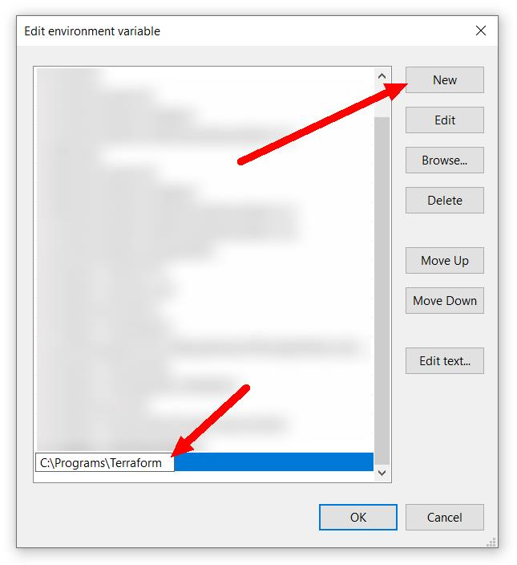

# 👣 First Steps with Huawei Cloud Terraform

🔙 Back to [README](../README.md).

🌐 **Language**: **English** | [Português](./FIRST_STEPS.pt.md)

- [👣 First Steps with Huawei Cloud Terraform](#-first-steps-with-huawei-cloud-terraform)
  - [⚙ Installation](#-installation)
    - [Windows (simple)](#windows-simple)
    - [Windows (advanced)](#windows-advanced)
    - [Ubuntu/Debian](#ubuntudebian)
  - [🔐 Creating an access key (AK and SK)](#-creating-an-access-key-ak-and-sk)
  - [👩‍💻 Main Commands](#-main-commands)
  - [😣 Troubleshooting](#-troubleshooting)

## ⚙ Installation

Install Terraform: <https://developer.hashicorp.com/terraform/install>

### Windows (simple)

1. Download the zip file for Windows AMD64 (available in the link above);
2. Extract file `terraform.exe` in the parent folder (that is, in the same
   folder as `main.tf` file);
3. Open PowerShell in the parent folder and run `./terraform version` to
   confirm it was installed successfully. You should see something like this:

      ```plain
      > ./terraform version
      Terraform v1.8.5
      on windows_amd64
      ```

### Windows (advanced)

1. Download the zip file for Windows AMD64 (available in the link above);
2. Create folder `C:\Programs\Terraform` and extract file `terraform.exe`
   inside it;
3. Open Windows Start menu, search for "system variables" and click on "Edit
   the system environment variables"

   

4. Click on "Environment Variables..." button in the bottom right

   

5. Select "Path" inside "System variables" and click on "Edit" in the bottom
   part:

   

6. Click on "New" in the right side and add `C:\Programs\Terraform`. Then, click
   on "OK" on all windows.

   

7. Open Command Prompt or PowerShell and run `terraform version` to confirm it
   was installed successfully. You should see something like this:

      ```plain
      > terraform version
      Terraform v1.8.5
      on windows_amd64
      ```

### Ubuntu/Debian

Run the following commands:

```sh
sudo apt update && sudo apt install -y gnupg software-properties-common

wget -O- https://apt.releases.hashicorp.com/gpg | \
  sudo gpg --dearmor -o /usr/share/keyrings/hashicorp-archive-keyring.gpg

echo "deb [signed-by=/usr/share/keyrings/hashicorp-archive-keyring.gpg] https://apt.releases.hashicorp.com $(lsb_release -cs) main" | sudo tee /etc/apt/sources.list.d/hashicorp.list

sudo apt update && sudo apt install -y terraform
```

Run command `terraform version` to confirm that Terraform is installed. You
should see something like this:

```plain
$ terraform version
Terraform v.18.5
on linux_amd64
```

## 🔐 Creating an access key (AK and SK)

An access key comprises an **access key ID (AK)** and **secret access key (SK)**,
and is used as a long-term identity credential to sign your requests for Huawei
Cloud APIs (made by Terraform provider). AK is used together with SK to sign
requests cryptographically, ensuring that the requests are secret, complete,
and correct. For more details, see
[Access Keys documentation](https://support.huaweicloud.com/intl/en-us/usermanual-ca/ca_01_0003.html)

To create an access key for your Huawei Cloud account, first log in to
[Huawei Cloud Console](https://console-intl.huaweicloud.com/).

1. Put your mouse over your username in the top right corner (A) and click on
   "My Credentials" (B) in the dropdown menu;

    

2. On the left side menu, click on "Access Keys" and then click on "Create
   Access Key";

    

3. Enter a description (optional) and then click on "OK";

    

4. Click on "Download" (G) in the modal message. A file named `credentials.csv`
   will be saved;

   

5. Open the `credentials.csv` file in Notepad. It should have the following
   layout:

    ```plain
    User Name,Access Key Id,Secret Access Key
    "username",**********,##########
    ```

6. On the second line, the second part is the Access Key (AK), and the third
   part is the Secret Key (SK).

## 👩‍💻 Main Commands

`terraform init` - Initializes Terraform provider and modules

`terraform plan` - Outputs what will be executed by Terraform

`terraform apply` - Executes the infrastructure changes

`terraform fmt` - Formats the Terraform code automatically

`terraform graph > graph.txt` - Generate a instructure description in a graph
format (DOT language) and saves it to `graph.txt` file. You can use the
<https://dreampuf.github.io/GraphvizOnline/> website to view the graph.

## 😣 Troubleshooting

If you encounter an error message that is unclear, or if you identified a
problem while using the provider, it is possible to configure Terraform to
generates debug logs by configuring environment variables `TF_LOG` and
`TF_LOG_PATH`.

If you are on Windows, run the following commands in PowerShell:

```powershell
$Env:TF_LOG="DEBUG"
$Env:TF_LOG_PATH="tf_log.txt"
```

If you are on Linux, run the following commands in your shell:

```bash
export TF_LOG="DEBUG"
export TF_LOG_PATH="tf_log.txt"
```

Then run the Terraform command again. The debug logs will be saved in the
`tf_log.txt` file. Please note that this debug configuration only applies to
the same terminal where the environment variables were previously configured.
