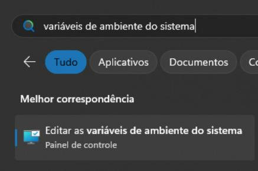
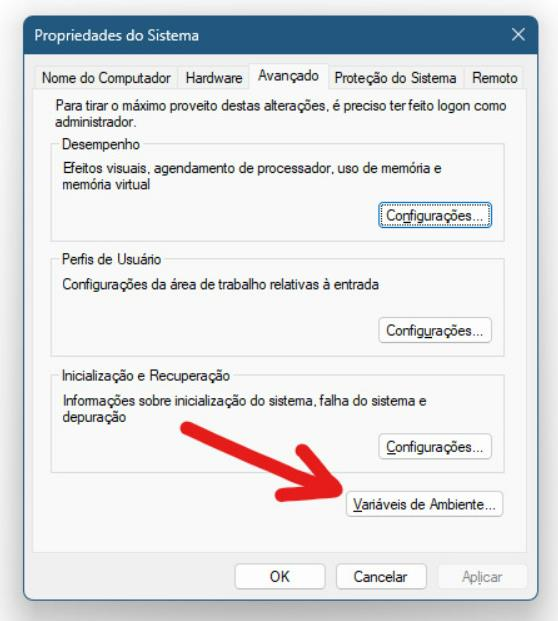
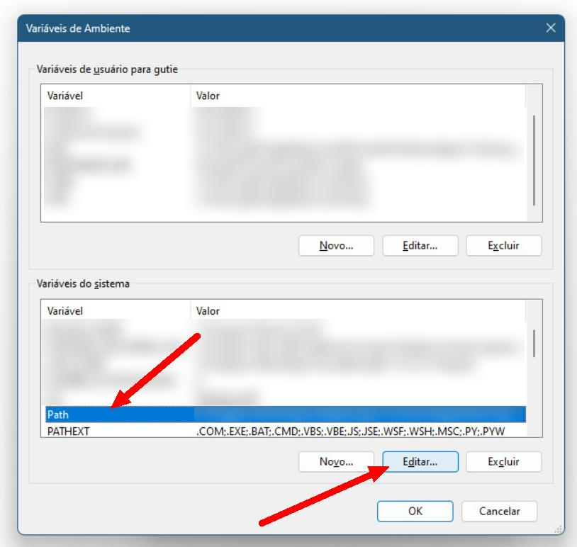
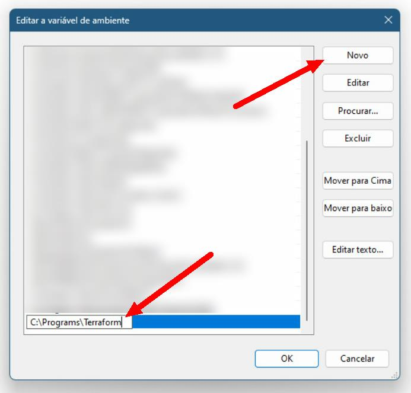

# 👣 Primeiros Passos com Huawei Cloud Terraform

🔙 Voltar ao [README](../README.pt.md).

🌐 **Idioma**: [English](./FIRST_STEPS.md) | **Português**

- [👣 Primeiros Passos com Huawei Cloud Terraform](#-primeiros-passos-com-huawei-cloud-terraform)
  - [⚙ Instalação](#-instalação)
    - [Windows (simples)](#windows-simples)
    - [Windows (avançado)](#windows-avançado)
    - [Ubuntu/Debian](#ubuntudebian)
  - [🔐 Criando uma chave de acesso (AK e SK)](#-criando-uma-chave-de-acesso-ak-e-sk)
  - [👩‍💻 Comandos Principais](#-comandos-principais)
  - [😣 Diagnóstico de problemas](#-diagnóstico-de-problemas)

## ⚙ Instalação

Instale o Terraform: <https://developer.hashicorp.com/terraform/install>

### Windows (simples)

1. Baixe o arquivo zip para Windows AMD64 (disponível no link acima);
2. Extraia o arquivo `terraform.exe` na pasta anterior (isto é, na mesma pasta
   que o arquivo `main.tf`);
3. Abra o PowerShell na pasta anterior e execute `./terraform version` para
   confirmar que foi instalado com sucesso. Você deve ver algo assim:

      ```plain
      > ./terraform version
      Terraform v1.8.5
      on windows_amd64
      ```

### Windows (avançado)

1. Baixe o arquivo zip para Windows AMD64 (disponível no link acima);
2. Crie a pasta `C:\Programs\Terraform` e extraia o arquivo `terraform.exe`
   dentro dela;
3. Abra o menu Iniciar do Windows, procure por "variáveis de ambiente do
   sistema" e clique em "Editar as variáveis de ambiente do sistema"

   

4. Clique em "Environment Variables..." button in the bottom right

   

5. Selecione a opção "Path" dentro de "Variáveis do sistema" e clique em
   "Editar..." na parte de baixo:

   

6. Clique em "Novo" do lado direito e adicione `C:\Programs\Terraform`. Em
   seguida, clique em "OK" em todas as janelas.

   

7. Abra o Prompt de Comando ou PowerShell e execute `terraform version` para
   confirmar que foi instalado com sucesso. Você deve ver algo assim:

      ```plain
      > terraform version
      Terraform v1.8.5
      on windows_amd64
      ```

### Ubuntu/Debian

Execute os seguintes comandos:

```sh
sudo apt update && sudo apt install -y gnupg software-properties-common

wget -O- https://apt.releases.hashicorp.com/gpg | \
  sudo gpg --dearmor -o /usr/share/keyrings/hashicorp-archive-keyring.gpg

echo "deb [signed-by=/usr/share/keyrings/hashicorp-archive-keyring.gpg] https://apt.releases.hashicorp.com $(lsb_release -cs) main" | sudo tee /etc/apt/sources.list.d/hashicorp.list

sudo apt update && sudo apt install -y terraform
```

Execute o comando `terraform version` para confirmar que o Terraform foi
instalado. Você deve ver algo assim:

```plain
$ terraform version
Terraform v.18.5
on linux_amd64
```

## 🔐 Criando uma chave de acesso (AK e SK)

Uma chave de acesso compreende uma **access key ID (AK)** e uma
**secret access key (SK)**, e é usada como uma credencial de identidade de
longo prazo para assinar suas requisições para as APIs da Huawei Cloud (feitas
pelo provider do Terraform). O AK é usado junto com o SK para assinar
requisições criptograficamente, garantindo que as requisições sejam secretas,
completas, e corretas. Para mais detalhes, consulte a
[documentação de Chaves de Acesso](https://support.huaweicloud.com/intl/en-us/usermanual-ca/ca_01_0003.html)

Para criar uma chave de acesso para sua conta Huawei Cloud, faça primeiro o
login no [Console da Huawei Cloud](https://console-intl.huaweicloud.com/).

1. Passe o mouse em cima do seu nome de usuário no canto superior direito (A)
   e clique em "My Credentials" (B) no menu dropdown;

    

2. No menu à esquerda, clique em "Access Keys" e em seguida clique em "Create
   Access Key";

    

3. Forneça uma descrição (optional) (E) e depois clique em "OK" (F);

    

4. Clique em "Download" (G) na mensagem seguinte. Um arquivo chamado
  `credentials.csv` será baixado;

   

5. Abra o arquivo `credentials.csv` no Bloco de Notas. Ele deve ter o seguinte
   layout:

    ```plain
    User Name,Access Key Id,Secret Access Key
    "username",**********,##########
    ```

6. Na segunda linha, a segunda parte é a Access Key (AK), e a terceira parte é
   a Secret Key (SK).

## 👩‍💻 Comandos Principais

`terraform init` - Inicializa o provider e os módulos do Terraform

`terraform plan` - Verificar o que será executado pelo Terraform

`terraform apply` - Executa as modificações na infraestrutura

`terraform fmt` - Formata o código automaticamente

`terraform graph > graph.txt` - Gera uma descrição da infraestrutura em formato
de grafo (DOT language), e salva no arquivo `graph.txt`. Você pode usar o site
<https://dreampuf.github.io/GraphvizOnline/> para visualizar o grafo.

## 😣 Diagnóstico de problemas

Caso você encontre alguma mensagem de erro que não seja clara, ou se você
identificou algum problema durante o uso do provider, é possível fazer com que
o Terraform gere logs para debug ao configurar as variáveis de ambiente
`TF_LOG` e `TF_LOG_PATH`.

Se estiver usando Windows, execute os seguintes comandos no PowerShell:

```powershell
$Env:TF_LOG="DEBUG"
$Env:TF_LOG_PATH="tf_log.txt"
```

Se estiver usando Linux, execute os seguintes comandos no Shell:

```bash
export TF_LOG="DEBUG"
export TF_LOG_PATH="tf_log.txt"
```

Em seguida, execute o comando Terraform novamente. Os logs para debug serão
salvos no arquivo `tf_log.txt`. Note que essa configuração de debug só se
aplica para o mesmo terminal no qual as variáveis de ambiente foram
configuradas.
