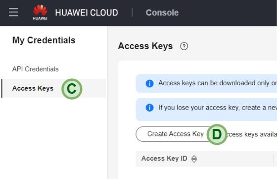

# 👣 Primeiros Passos com Huawei Cloud Terraform

🔙 Voltar ao [README](../README.pt.md).

🌐 **Idioma**: [English](./FIRST_STEPS.md) | **Português**

## Instalação

Instale o Terraform: <https://developer.hashicorp.com/terraform/install>

### Windows

1. Baixe o arquivo zip;
2. Extraia o arquivo `terraform.exe` nesta pasta, na pasta `C:\Windows` (ou em
   outra pasta que esteja no path do sistema operacional);
3. Abra o Prompt de Comando ou o PowerShell e execute `terraform.exe -version`
   para confirmar que foi instalado com sucesso.

## Ubuntu/Debian

Execute os seguintes comandos:

```sh
sudo apt update && sudo apt install -y gnupg software-properties-common

wget -O- https://apt.releases.hashicorp.com/gpg | \
  sudo gpg --dearmor -o /usr/share/keyrings/hashicorp-archive-keyring.gpg

echo "deb [signed-by=/usr/share/keyrings/hashicorp-archive-keyring.gpg] https://apt.releases.hashicorp.com $(lsb_release -cs) main" | sudo tee /etc/apt/sources.list.d/hashicorp.list

sudo apt update && sudo apt install -y terraform
```

Verifique se o Terraform foi instalado:

```sh
terraform -version
```

## Criando uma chave de acesso (AK e SK)

Uma chave de acesso compreende uma **access key ID (AK)** e uma
**secret access key (SK)**, e é usado como uma credencial de identidade de
longo prazo para assinar suas requisições para as APIs da Huawei Cloud (usadas
pelo provider do Terraform). O AK é usado junto com o SK para assinar
requisições criptograficamente, garantindo que as requisições sejam secretas,
completas, e corretas. Para mais detalhes, consulte a
[documentação de Chaves de Acesso](https://support.huaweicloud.com/intl/en-us/usermanual-ca/ca_01_0003.html)

Para criar uma chave de acesso para sua conta, primeiro realize o login no
[Console da Huawei Cloud](https://console-intl.huaweicloud.com/).

1. Passe o mouse em cima do seu nome de usuário no canto superior direito (A)
   e clique em "My Credentials" (B) no menu dropdown;

    

2. No menu à esquerda, clique em "Access Keys" e em seguida clique em "Create
   Access Key";

    

3. Forneça uma descrição (optional) (E) e depois clique em "OK" (F);

    

4. Clique em "Download" (G) na mensagem seguinte. Um arquivo chamado
  `credentials.csv` será baixado;

   

5. Abra o arquivo `credentials.csv` no Bloco de Notas. Ele deve ter o seguinte
   layout:

    ```plain
    User Name,Access Key Id,Secret Access Key
    "username",**********,##########
    ```

6. Na segunda linha, a segunda parte é a Access Key (AK), e a terceira parte é
   a Secret Key (SK).

## Comandos Principais

`terraform init` - Inicializa o provider e os módulos do Terraform

`terraform plan` - Verificar o que será executado pelo Terraform

`terraform apply` - Executa as modificações na infraestrutura

`terraform fmt` - Formata o código automaticamente

`terraform graph > graph.txt` - Gera uma descrição da infraestrutura em formato
de grafo (DOT language), e salva no arquivo `graph.txt`. Você pode usar o site
<https://dreampuf.github.io/GraphvizOnline/> para visualizar o grafo.

## Diagnóstico de problemas

Caso você encontre alguma mensagem de erro que não seja clara, ou se você
identificou algum problema durante o uso do provider, é possível fazer com que
o Terraform gere logs para debug ao configurar as variáveis de ambiente
`TF_LOG` e `TF_LOG_PATH`.

Se estiver usando Windows, execute os seguintes comandos no PowerShell:

```powershell
$Env:TF_LOG="DEBUG"
$Env:TF_LOG_PATH="tf_log.txt"
```

Se estiver usando Linux, execute os seguintes comandos no Shell:

```bash
export TF_LOG="DEBUG"
export TF_LOG_PATH="tf_log.txt"
```

Em seguida, execute o comando Terraform novamente. Os logs para debug serão
salvos no arquivo `tf_log.txt`. Note que essa configuração de debug só se
aplica para o mesmo terminal no qual as variáveis de ambiente foram
configuradas.
